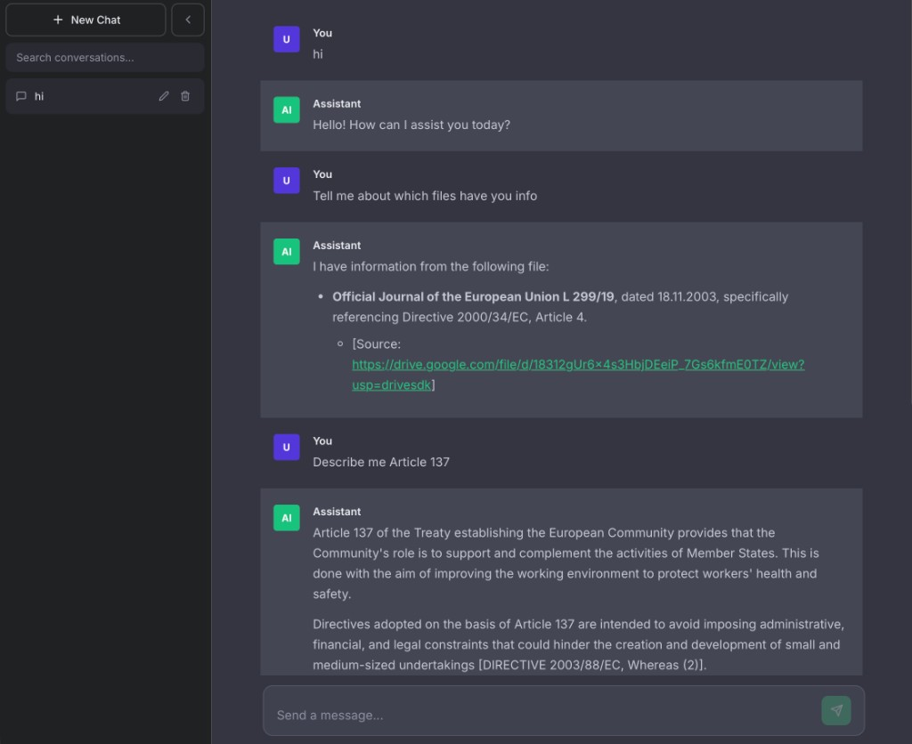

# RAG Chatbot

Web chat UI backed by **FastAPI**, **Redis**, **Google Gemini**, and optional **Vertex AI RAG Engine** retrieval. One Docker image runs the compiled React app, the API, and an embedded Redis instance.

The app has **no accounts or login**. All stored conversations use a single internal user id.

### Keep in mind that I used a free and limited gemini usage

---

## What you get

- Sidebar: conversations, search, rename, delete, new chat
- Chat area: markdown, GitHub-flavored extras, syntax-highlighted code blocks
- **Streaming** assistant replies over **Server-Sent Events (SSE)**
- **Long-context behavior**: rolling summary in Redis + last 10 messages + RAG snippets for the current question
- **Same-origin** deployment in Docker (UI and API on port 8000)

---

## UI preview

Dark-themed chat layout: sidebar (new chat, search, conversation list), main thread with user/assistant bubbles, and grounded answers when RAG returns corpus chunks (e.g. document titles and source links).



Short screen recording of the app in use:

<video src="docs/media/demo-screen-recording.mov" controls width="100%" playsinline>
  Your browser does not support embedded video. <a href="docs/media/demo-screen-recording.mov">Open or download the demo</a> (<code>.mov</code>).
</video>

If the video does not play in your viewer (some hosts only reliably inline MP4), open [`docs/media/demo-screen-recording.mov`](docs/media/demo-screen-recording.mov) directly or download it from the repository.

---

## Stack

| Layer | Technology |
|--------|------------|
| UI | React 18, Create React App, react-markdown, Prism highlighting |
| API | FastAPI, Uvicorn, Pydantic / pydantic-settings |
| Data | Redis (async client, in-memory in container) |
| LLM | `google-genai` + `GOOGLE_API_KEY` |
| RAG | Vertex `retrieveContexts` REST API + service account OAuth2 (`httpx`, `google-auth`) |
| Container | Multi-stage: Node 22 Alpine → Python 3.13 Alpine, `redis-server` + `uvicorn` |

---

## How it fits together

```
Browser ──HTTP/SSE──► FastAPI (/api/*)
                          │
          ┌───────────────┼───────────────┐
          ▼               ▼               ▼
       Redis          Gemini API      Vertex RAG
    (state)           (API key)    (service account)
```

1. User sends a message → `POST /api/chat/send`.
2. Backend stores the user turn, may refresh a **conversation summary**, calls **RAG** with the latest query, builds a **context payload** (system + summary + RAG + recent turns), streams Gemini output as SSE.
3. Full reply is persisted and new threads can get an auto-generated **title**.

---

## Repository layout

```
.
├── Dockerfile              # Frontend build + Python runtime + start script
├── docker-compose.yml      # Single service, env + optional SA key mount
├── Documentation.tex       # LaTeX source for technical PDF
├── Documentation.pdf       # Generated documentation (rebuild from .tex)
├── docs/media/             # README screenshot + demo screen recording
├── backend/
│   ├── requirements.txt
│   └── app/
│       ├── main.py         # App factory, CORS, static SPA, /api/health
│       ├── core/           # config, Redis pool
│       ├── models/chat.py  # Pydantic + Redis “table” helpers
│       ├── routes/chat.py  # REST + SSE send
│       └── services/rag_service.py
└── frontend/
    └── src/                # App.js, Sidebar, ChatArea, services/api.js
```

---

## Run with Docker (recommended)

**1.** Create a root `.env` (Compose reads it automatically). You can start from the backend template:

```bash
cp backend/.env.example .env
```

**2.** Set at least:

- `GOOGLE_API_KEY` — Gemini (enable **Generative Language API** on the API key’s project if needed)
- `GCP_PROJECT_ID`, `GCP_LOCATION`, `RAG_CORPUS_NAME` — your Vertex RAG corpus resource name
- `GEMINI_MODEL_NAME` — e.g. `gemini-2.5-flash`

**3.** For RAG retrieval, the Vertex endpoint expects a **bearer token** from a service account (not the API key). Put a JSON key on the host and wire it in `.env`:

```env
GCP_SA_KEY_PATH=./sa-key.json
GOOGLE_APPLICATION_CREDENTIALS=/app/credentials/sa-key.json
```

If you skip RAG, leave `GCP_SA_KEY_PATH` unset; Compose defaults the volume to `/dev/null` and the app still answers without corpus context.

**4.** Build and start:

```bash
docker compose up --build
```
---

## Environment variables

| Variable | Purpose |
|----------|---------|
| `REDIS_URL` | Redis URL (container default: `redis://localhost:6379/0`) |
| `GCP_PROJECT_ID` | GCP project for Vertex |
| `GCP_LOCATION` | Region (e.g. `europe-west3`) |
| `RAG_CORPUS_NAME` | Full corpus resource name |
| `GEMINI_MODEL_NAME` | Gemini model id |
| `GOOGLE_API_KEY` | Gemini API key |
| `GOOGLE_APPLICATION_CREDENTIALS` | Path **inside the container** to the SA JSON (e.g. `/app/credentials/sa-key.json`) |
| `CORS_ORIGINS` | Comma-separated origins or `*` |
| `STATIC_DIR` | Built frontend root (`/app/static` in Docker; empty for API-only local dev) |
| `PORT` | Published host port (Compose; default `8000`) |
| `GCP_SA_KEY_PATH` | Host path to SA JSON mounted read-only at `/app/credentials/sa-key.json` |

---

## Local development (no Docker)

**Redis** must be running locally.

**Backend**

```bash
cd backend
python -m venv venv && source venv/bin/activate  # Windows: venv\Scripts\activate
pip install -r requirements.txt
cp .env.example .env
# Edit .env: REDIS_URL, GOOGLE_API_KEY, GCP_*, RAG_*, GOOGLE_APPLICATION_CREDENTIALS=/absolute/path/to/key.json
uvicorn app.main:app --reload --port 8000
```

`STATIC_DIR` should be kept empty so FastAPI does not serve a production build.

**Frontend**

```bash
cd frontend
npm install
cp .env.example .env
# REACT_APP_API_URL=http://localhost:8000
npm start
```

Dev UI: **http://localhost:8000**.

---

## HTTP API (summary)

| Method | Path | Notes |
|--------|------|--------|
| GET | `/api/health` | `{"status":"ok"}` |
| GET | `/api/chat/conversations` | List conversations |
| POST | `/api/chat/conversations` | Create conversation |
| GET | `/api/chat/conversations/{id}` | Metadata |
| PUT | `/api/chat/conversations/{id}` | Update fields |
| DELETE | `/api/chat/conversations/{id}` | Delete thread + Redis keys |
| GET | `/api/chat/conversations/{id}/messages` | Message list |
| POST | `/api/chat/send` | Body: `{"message":"...","conversation_id":null\|uuid}`. Response: **SSE** stream, then final event with `conversation_id`. |
---

## Technical documentation (PDF)

Long-form design and implementation: **`Documentation.pdf`** (source: **`Documentation.tex`**). Rebuild with LaTeX locally or:

```bash
docker run --rm -v "$PWD:/work" -w /work danteev/texlive:latest \
  sh -c "pdflatex -interaction=nonstopmode Documentation.tex && pdflatex -interaction=nonstopmode Documentation.tex"
```

---

## Security notes

- Never commit `.env`, API keys, or `sa-key.json`. They are listed in `.gitignore`.
- I used `CORS_ORIGINS=*` just for demo

